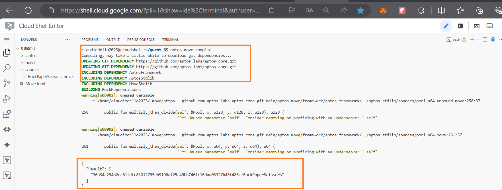
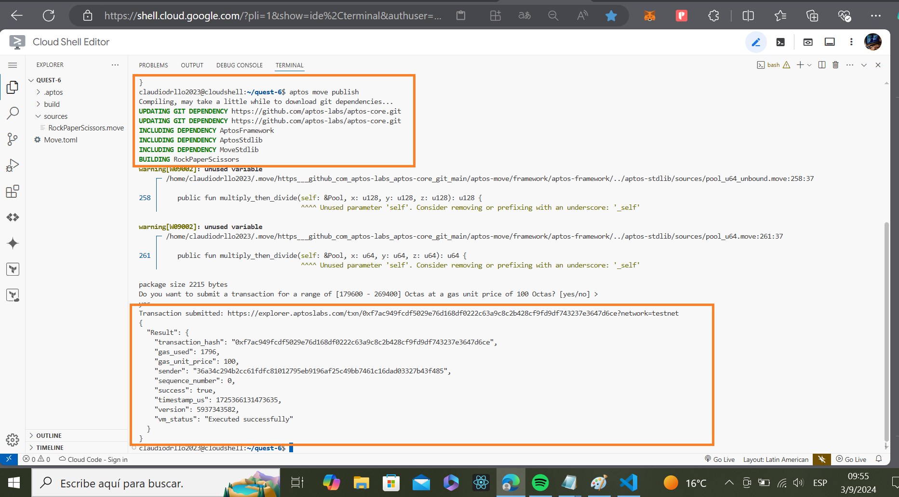
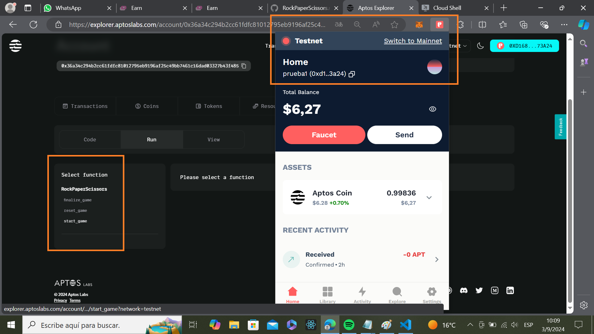
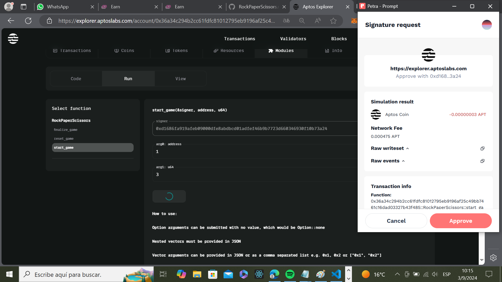
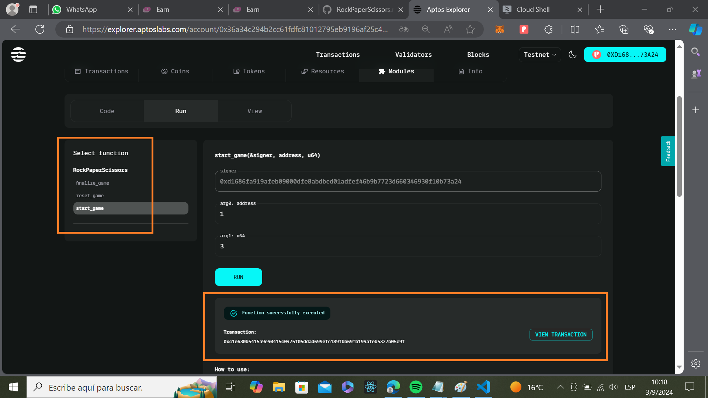

# RockPaperScissors - Aptos Smart Contract

## Objetivo del Proyecto

Este proyecto consiste en desarrollar un contrato inteligente de un juego de **Piedra, Papel o Tijera** en la blockchain de **Aptos**. El trabajo se realiza de manera incremental, añadiendo nuevas funcionalidades en diferentes etapas, compilando y publicando el código, y realizando pruebas de cada funcionalidad en el **Aptos Explorer**. La integración de la billetera **Petra** permitirá interactuar con el contrato inteligente en un entorno real, realizando apuestas con tokens y validando los resultados del juego.

## Enfoque de Desarrollo

El enfoque adoptado para este proyecto se basa en un desarrollo iterativo e incremental, donde cada funcionalidad es añadida, testeada y documentada antes de avanzar a la siguiente. Este ciclo involucra:

1. **Desarrollo y compilación:** Se implementan nuevas funcionalidades en el contrato inteligente y se verifica su correcta compilación.
2. **Publicación en Aptos:** El contrato se despliega en la red de prueba de Aptos utilizando la billetera **Petra**.
3. **Pruebas:** Se realizan pruebas funcionales en Aptos Explorer para asegurarse de que las nuevas características funcionan como se espera.
4. **Documentación:** Se documenta cada etapa del proceso, incluyendo capturas de pantalla de las pruebas y resultados, para dejar un registro claro y detallado.

## Instalación y Configuración Inicial

Antes de comenzar a interactuar con el contrato inteligente, se deben cumplir los siguientes pasos:

### Requisitos Previos

- Tener instalada la billetera **Petra Wallet** (disponible como extensión del navegador).
- Contar con un entorno de desarrollo de **Move** configurado.
- Tener acceso a la red de prueba (Testnet) de **Aptos**.

### Instalación de Dependencias

Primero, asegúrate de tener instalado el entorno de desarrollo de Move. Puedes seguir la documentación oficial de Aptos para instalar las herramientas necesarias.


## Estructura del Proyecto

El proyecto consta de las siguientes carpetas y archivos:

```
├── sources
│   └── RockPaperScissors.move  # Código principal del contrato inteligente
├── scripts
│   └── deploy.sh               # Script para desplegar el contrato en Aptos
├── tests
│   └── test_game.move          # Pruebas automatizadas
└── README.md                   # Documentación del proyecto
```

## Funcionalidades del Contrato Inteligente

### 1. Creación del Juego

La primera funcionalidad implementada es la creación de un nuevo juego entre dos jugadores. Los jugadores pueden apostar tokens y seleccionar su movimiento (Piedra, Papel o Tijera). Los detalles de cada juego se almacenan en una estructura de datos `Game`.

- **Función:** `start_game`
- **Parámetros:**
  - `account`: dirección del jugador 1.
  - `player2`: dirección del jugador 2.
  - `bet_amount`: monto apostado.

```move
public entry fun start_game(account: &signer, player2: address, bet_amount: u64) {
  let player1 = signer::address_of(account);
  assert!(coin::balance<AptosCoin>(player1) >= bet_amount, 1);

  let game = Game {
    player1,
    player2,
    player1_move: 0,
    player2_move: 0,
    bet: bet_amount,
    is_active: true,
  };

  move_to(account, game);
  coin::transfer<AptosCoin>(account, player2, bet_amount);
}
```

### 2. Reinicio del Juego

La segunda funcionalidad implementada permite reiniciar el juego a su estado inicial, permitiendo que los jugadores puedan volver a apostar y jugar nuevamente.

- **Función:** `reset_game`
- **Descripción:** Resetea los movimientos y la apuesta a 0, y reactiva el juego.

```move
public entry fun reset_game(account: &signer) acquires Game {
  let mut game = borrow_global_mut<Game>(signer::address_of(account));
  assert!(game.is_active, 2);

  game.player1_move = 0;
  game.player2_move = 0;
  game.bet = 0;
  game.is_active = true;
}
```

## Compilación y Despliegue

Para compilar el contrato, utiliza el siguiente comando en el terminal:

```bash
aptos move compile
```

Luego, para desplegar el contrato en la red de prueba de Aptos:

```bash
aptos move publish --assume-yes --max-gas 10000
```

Una vez publicado el contrato, puedes interactuar con él desde tu billetera Petra y realizar las pruebas correspondientes en **Aptos Explorer**.

## Capturas de Pantalla

### 1. Compilación Exitosa





### 2. Despliegue del Contrato en Aptos Testnet



### 3. Interacción con el Contrato






